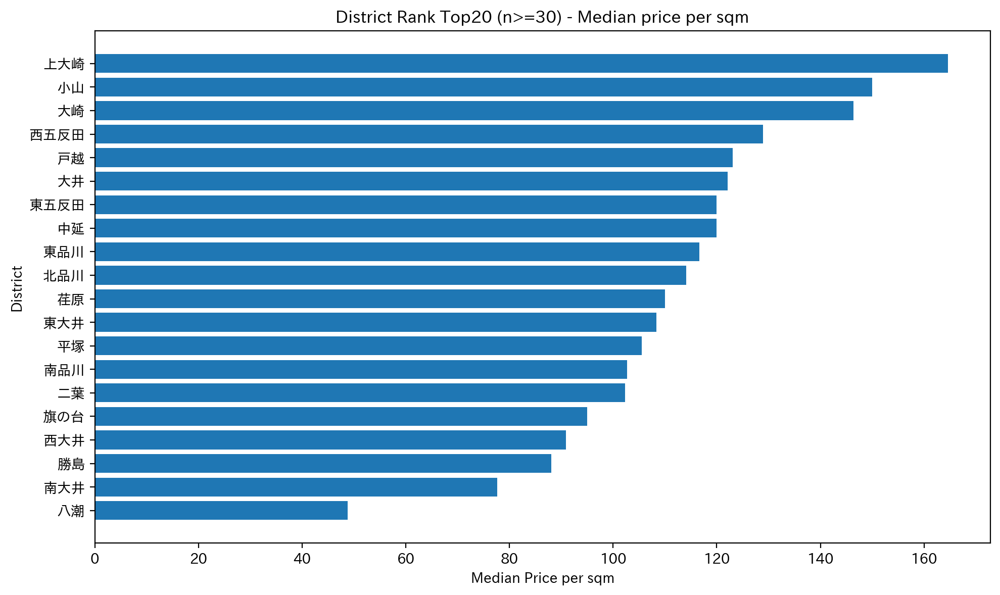
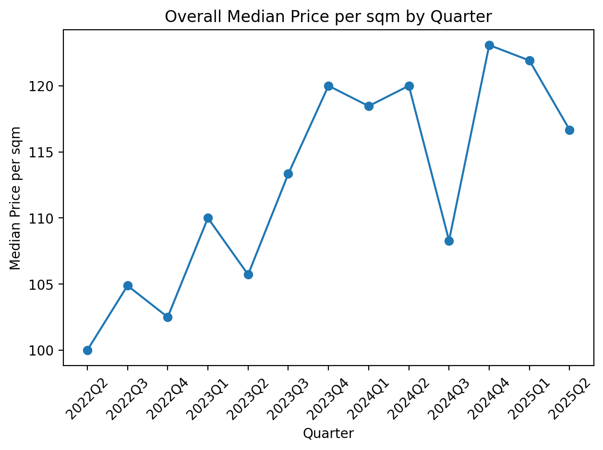
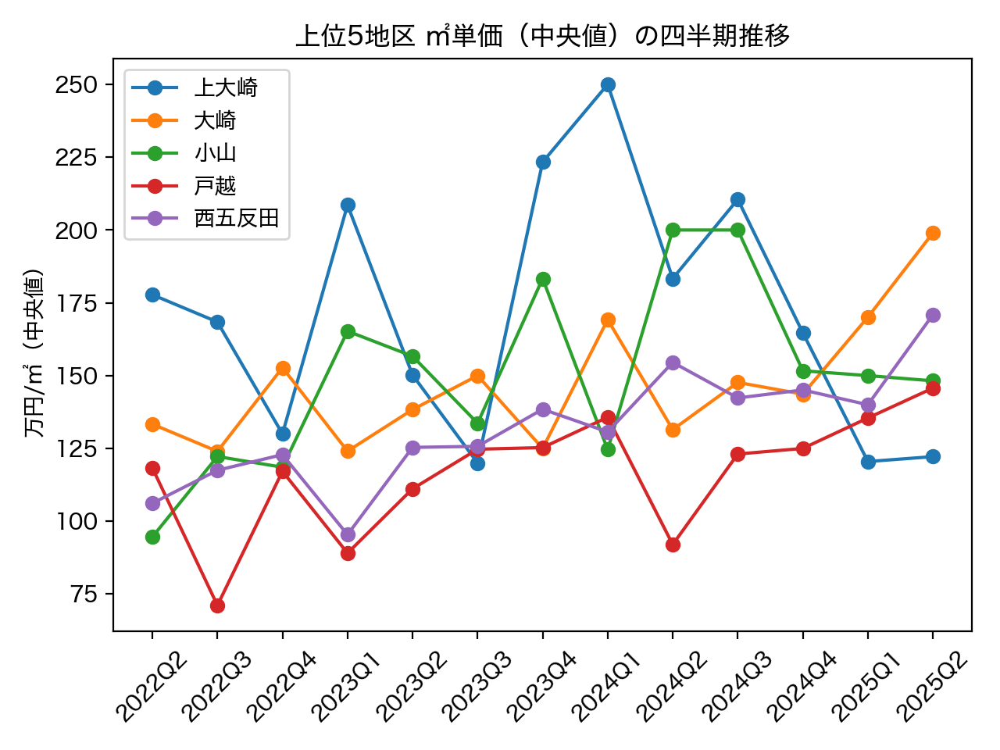

# 品川区マンション取引データ：相場把握（㎡単価・四半期推移）

品川区のマンション取引データを用いて地区別の㎡単価（中央値）と四半期ごとの推移を可視化し、相場感を把握できるようにまとめました。

- 対象期間：2022Q2〜2025Q2
- 目的：地区別の㎡単価（中央値）と四半期推移を可視化し、相場感を把握する
- 成果物：outputs/figures（図）・outputs/tables（集計CSV）／再現手順は下部に記載

## 可視化（Figures）

### 1) 地区別 ㎡単価（中央値）Top20（n>=30）


#### 読み方
- **横軸：㎡単価（中央値）／縦軸：地区（上位20）**
- 「地区間の価格差」と「上位地区の集中度」を見る図

#### 観察（図から事実として言えること）
- 上位3地区：**上大崎（164.6） / 小山（150.0） / 大崎（146.4）**〔単位：万円/㎡〕
- Top20内 最大：**上大崎（164.6）** / 最小：**八潮（48.8）** → **レンジ：115.8 万円/㎡（相対差：237.6%）**
- 分布：中央値 **112.1**、IQR（Q75−Q25）**21.8**（Q25=**100.5**, Q75=**122.3**）
- 段差が最大：**順位19→20で 28.9 万円/㎡ 下がる**

#### 示唆（業務での使い道）
- **エリア別戦略**：価格差が大きいため、**上位エリア優先**で「販売・仕入れ・広告配分」を設計できる
- **顧客提案**：同条件で比較する際に「予算帯ごとの候補地区（上位/中位/下位）」を提示しやすい
- **異常検知**：上位が突出している場合、築年・駅距離・面積などの偏りの可能性 → 次の切り分けに繋げられる

#### 次アクション（1つだけ）
- `district × 築年帯` で再集計し、上位地区が「立地」なのか「築浅比率」なのかを切り分ける


### 2) 全体 ㎡単価（中央値）の四半期推移


#### 読み方
- 横軸：四半期（quarter）／縦軸：㎡単価（**中央値**、単位：万円/㎡）
- 市場全体の「上昇・下落・横ばい」と、変化のタイミングを確認する図

#### 観察（図から事実として言えること）
- 期間：**2022Q2 → 2025Q2**
- 期間変化：**100.0 → 116.7**（差分 **+16.7 万円/㎡**、変化率 **+16.7%**）
- 最高値：**2024Q4（123.1）** ／ 最低値：**2022Q2（100.0）** → レンジ **23.1 万円/㎡**
- 最大上昇（前期差 QoQ）：**2024Q4 で +14.8** ／ 最大下落（前期差 QoQ）：**2024Q3 で -11.7**（単位：万円/㎡）
- 変動の大きさ（標準偏差）：**7.9**

#### 示唆（業務での使い道）
- **相場の基準線**：個別物件の価格が「市場全体に対して高い／安い」を説明する根拠になる
- **施策タイミング**：変化が大きい四半期（例：2024Q3→Q4）を起点に、広告強化・仕入れ判断の検討材料にできる
- **モニタリング指標**：四半期ごとの中央値をKPIとして定点観測し、市況変化を早期に把握できる

#### 次アクション（1つだけ）
- QoQ（前期差）を系列として表・グラフ化し、**変化が大きい四半期**を一覧で特定する（例：上位3つを抽出）


### 3) 上位5地区 ㎡単価（中央値）の四半期推移


#### 読み方
- 横軸：四半期（quarter）／縦軸：㎡単価（**中央値**、単位：万円/㎡）
- **上位5地区のトレンド差（伸び・安定・地区間の開き）**を比較する図

#### 観察（図から事実として言えること）
- 最新四半期（**2025Q2**）で最高：**大崎（199.0 万円/㎡）**
- 伸びが最大（初期→最新の差分）：**大崎（+65.7 万円/㎡、変化率 49.3%）**
- 最も安定（標準偏差が最小）：**西五反田（標準偏差 20.0）**
- 地区間の乖離（max−min）：**初期 83.2 → 最新 76.8（差分 −6.3）**

#### 示唆（業務での使い道）
- **重点エリア選定**：伸びが大きい地区（例：大崎）を「注力候補」として営業・広告・仕入れ判断に使える
- **リスク管理**：安定している地区（例：西五反田）は価格ブレが小さい想定で、提案や在庫方針を立てやすい
- **市場理解**：上位地区間の開き（max−min）の変化を見ることで、「上位内の格差が広がった/縮んだ」を説明できる

#### 次アクション（1つだけ）
- 取引件数（volume）の推移も併記し、価格上昇が「需要増」か「成約少でブレ」かを切り分ける

### 集計結果（Tables）

※ CSV は生成物のため **Gitにはコミットしません**（.gitignore 対象）  
ローカルで `notebooks/01_eda.ipynb` を上から実行（または `bash scripts/export_tables.sh` を実行）すると `outputs/tables/` に出力されます。

- 出力先：`outputs/tables/`
- 出力形式：`*.csv`

## 使用言語・環境

### 使用言語／クエリ
- Python（Jupyter Notebook：集計・CSV出力・可視化）
- SQL（PostgreSQL：View作成・集計）
- Markdown（README整備）

### 開発・実行環境
- Mac（ローカル）
- VS Code（Jupyter/Python実行、README編集、SQLファイル管理）
- Python 3.11.x
- Docker / Docker Compose（PostgreSQL環境構築）
- PostgreSQL（DB：real_estate／ユーザー：yama）
- psql（View確認、SQL実行）
- Git / GitHub（成果物管理：commit/push）

## 再現手順

### 1) Python環境の準備（推奨：venv）
```bash
python -m venv .venv
source .venv/bin/activate
python -m pip install -U pip
python -m pip install -r requirements.txt
```


notebooks/01_eda.ipynb を上から実行すると outputs/ に図表・集計CSVが生成されます。

## （任意）Docker+PostgreSQLでSQL集計する手順

### 前提
- Docker Desktop が起動している
- `docker compose ps` で `real_estate_pg` が `Up` になっている

### 補足（任意）
- Python 3.11 を想定
- outputs/ が無い場合は実行時に作成されます

　 **注意**
- もし `pip install -r requirements.txt` の行の上にある ```bash を閉じてないと、  
  その下に書いた文章が全部 “コード扱い” になっちゃいます。

`pip install -r` は requirements.txt を読み込んでインストールする公式の使い方です。 

---

## 2) requirements.txt は「ファイルの中に入れる」ってこと？
はい。**requirements.txt の中身が本体**です。フォーマットは「1行に1つ」パッケージ名（必要なら `==` でバージョン固定）です。

---

## A（最短）: いまの環境から requirements.txt を埋める方法
いま notebook が動いてるなら、まずはこれが一番ラクです。

```bash
# プロジェクト直下で
python -m pip freeze > requirements.txt
cat requirements.txt | head

git add requirements.txt
git commit -m "chore: fill requirements.txt"
git push origin main
```

# real_estate_open_data

不動産オープンデータを用いて、**中古マンションの相場把握**を目的とした分析プロジェクトです。  
本リポジトリでは、実務を想定し「データ取得 → 前処理 → EDA → SQL集計 → 可視化」を段階的に進めています。

---

## 目的

- 市区町村別・時系列で **価格水準と分布感** を把握する
- 価格予測や市場分析を行う前段として、  
  **相場の全体像を整理すること**を目的とする

---

## 使用データ

- 不動産オープンデータ（中古マンション取引情報）
- 対象期間：複数年（四半期単位で集計）
- 主な項目：
  - 取引価格
  - 専有面積
  - 市区町村
  - 取引時期（四半期）

※ 個人情報・スクレイピングは行っていません。

---

## ▶実行方法（EDA）

```bash
pip install -r requirements.txt
```

---

## EDA（探索的データ分析）の内容

- ㎡単価を用いた価格水準の比較
- 市区町村別の価格分布・件数確認
- 四半期ごとの価格推移の可視化
- 件数が少なすぎる市区町村を除外した分析（n≥30）

---

## 主な成果物（EDA）

### 図表（PNG）
- `outputs/figures/district_rank_top20.png`  
  → 市区町村別 ㎡単価 上位ランキング  
- `outputs/figures/trend_all_median.png`  
  → 全体の価格推移（中央値）  
- `outputs/figures/trend_top5_median.png`  
  → 上位市区町村の価格推移比較  

### 集計結果（CSV）
- `outputs/tables/price_by_district_all.csv`
- `outputs/tables/price_by_district_n30.csv`
- `outputs/tables/trend_all.csv`
- `outputs/tables/trend_top5_district.csv`

---

## ディレクトリ構成（抜粋）

```text
real_estate_open_data/
├── notebooks/
│   └── 01_eda.ipynb
├── outputs/
│   ├── figures/
│   └── tables/
├── data/
├── README.md
```